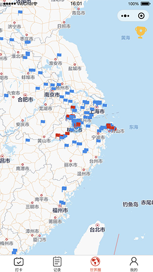
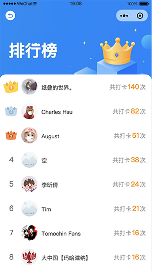

# punch-chicken
高级打卡鸡，小程序云开发项目

## cloudfunctions
各类云函数入口

## miniprogram
小程序C端代码

### 功能介绍 
用于记录用户在`各个时段的地理位置`，打点位置会进行`连线`，可以看到自己在世界地图上去过的地方，以及各个地方的频次。

非常方便各类`旅游人士`，看到自己慢慢的打满`地图`，非常有`成就感`，也非常有意义。

目前项目已接入云开发，数据已`持久化`，由第一版本的storage修改为云开发，不再担心数据会丢失。

#### 首页
首页，可以在地图看到自己所在的位置，并进行`打卡`，打卡后会生成分享图，便于进行朋友圈传播，也可以直接进行分享。

#### 记录页

`历史记录`页，可以看到自己以往所有的打点详情，并可以左滑删除对应记录

#### 世界圈
可以在`世界圈`看到各个用户的打卡情况，自身的打卡与其他用户做区分，同时为了保证用户的隐私，仅展示打卡时间和打卡地点。
右上角还新增了榜单功能，可以进入到榜单页看到各个用户的打卡排行榜，争取多打卡展示到top10吧。

#### 个人页
展示一些基本用户信息，放置了`天气信息`，可以方便的查看天气情况
点击头像有惊喜，现在流行的`头像制作`功能，已集成到打卡鸡中，头像使用了挺久，换个头像试试？

### License
Apache License Version 2.0

## 其他
功能还在迭代中，各位有兴趣的可以使用下，有`问题或想法`的可以提交issues联系

